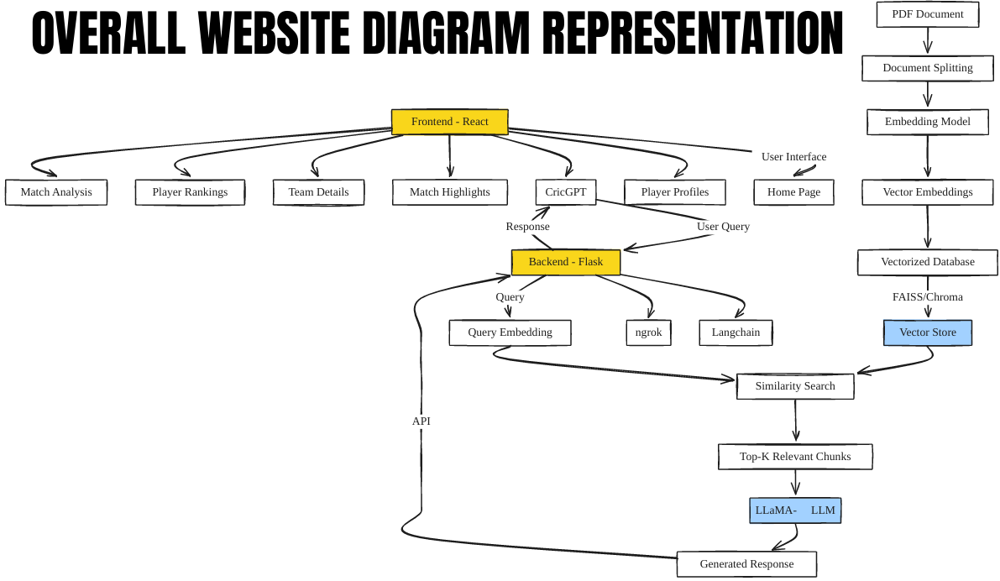

# 🏏 CricketLLM – Intelligent Cricket Chatbot with RAG & LLM

CricketLLM is a **domain-specific AI chatbot** designed to answer cricket-related queries using **LangChain**, **HuggingFace LLMs**, **FAISS vector search**, and **RAG (Retrieval-Augmented Generation)**. It’s powered by the `LLaMA 2 GPTQ` model and understands deep cricket knowledge from curated PDFs like ICC reports, making it ideal for fans, broadcasters, and analysts.

---

## 📌 What CricketLLM Does

- 🧠 Understands cricket queries like *“Who scored the most runs in T20 WC 2024?”*
- 📄 Extracts data from cricket PDFs and matches queries to the best info
- 🛠️ Uses **RAG**: retrieves relevant PDF context and feeds it to a smart LLM
- 🌐 Connected to a **React frontend** and exposed via Flask+ngrok API

---

## 🧩 System Architecture

**Main Components:**

- **Frontend**: Built in **React.js** with chat UI
- **Backend API**: Built using **Flask** and exposed with **ngrok**
- **LLM**: `LLaMA 2 13B GPTQ` from HuggingFace
- **Retriever**: FAISS vector search from cricket documents
- **Embedding**: `sentence-transformers` for vectorization
- **Prompt Handling**: LangChain + Prompt Templates

---

## 💡 Features

✔️ Ask natural language questions about ICC reports or cricket facts  
✔️ LLM-powered answers grounded in real cricket documents  
✔️ Custom prompts to reduce hallucination  
✔️ Chat interface with API exposed for integration  
✔️ RAG flow with semantic PDF understanding

---

## 🖼️ Project Demo

### 🔍 Query: “Which team was announced as Team of the Tournament by ICC in T20 World Cup 2024?”

---

## ⚙️ Technologies Used

| Layer         | Tech Stack                               |
|---------------|-------------------------------------------|
| LLM           | LLaMA 2 13B GPTQ                         |
| Embeddings    | sentence-transformers                   |
| Retriever     | FAISS Vector Store                      |
| Framework     | LangChain + HuggingFace Transformers    |
| Backend       | Flask + CORS + Ngrok                    |
| Frontend      | React.js                                |
| Data Source   | ICC World Cup 2024 PDF                  |

---

🧠 How it Works (RAG Flow)
1. 🧾 Load ICC T20 World Cup 2024 PDF

2. ✂️ Chunk and embed using Sentence Transformers

3. 🔍 Store vectors using FAISS

4. ❓ User asks a question

5. 📚 Retriever fetches relevant chunks

6. 💬 LLaMA model generates answer using LangChain prompt

You can use my sample dataset provided and work with the chatbot.

